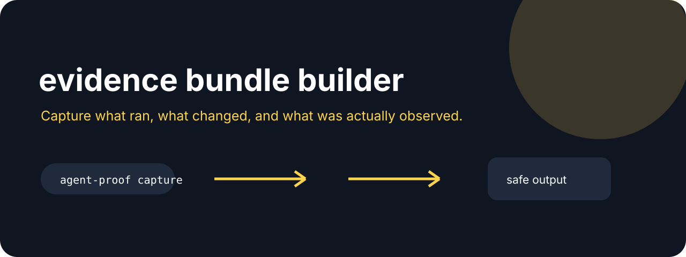

# Agent Proof



**Capture what ran, what changed, and what was actually observed.**

[](https://github.com/jonah-ux/agent-proof/actions/workflows/ci.yml)
[](https://www.python.org/)
[](LICENSE)

Agent Proof is a local, standard-library-only evidence ledger for agent workflows. It turns
command metadata, redacted output digests, repository identity, sibling tool envelopes, and
artifact hashes into a tamper-evident record. Records can be chained, merged into a run proof,
rendered for a human, independently verified, and exported as a deterministic bundle.

The tool separates **integrity** from **outcome**. A valid hash does not mean a user-visible
result happened. `observed`, `partial`, and `unknowns` remain explicit in every record.

## Try the complete workflow

This route checks out the `v0.4.1` prerelease so the bundled demo and native adapters are present.

```console
git clone --branch v0.4.1 --depth 1 https://github.com/jonah-ux/agent-proof.git
cd agent-proof
python3 -m venv .venv
. .venv/bin/activate
python3 -m pip install .
agent-proof --version
python3 demos/demo.py
```

The [standalone evidence-chain walkthrough](docs/walkthrough/index.html) turns the same
synthetic flow into a clickable visual readback. It uses fixture data only, includes an illustrative
tamper-refusal interaction, and links back to the source files and published release.

Agent Proof is intentionally installable and runnable on its own. It has no runtime dependency
on another Jonah-UX repository, local service, or sibling checkout. The optional interoperability
adapter can read recognized envelope files when you provide them, but the core CLI, demo, record,
ledger, graph, and bundle verification paths remain self-contained.

The synthetic demo composes policy, sandbox, and evaluation JSON envelopes, creates two linked
records, merges them, tampers with an artifact, proves that verification refuses it, restores the
artifact, and exports a deterministic tarball. It never reads local transcripts or credentials.

The reviewed interop registry also recognizes native `agent-sandbox/v2`,
`agent-trace/inspect/v1`, `agent-trace/query/v1`, `mcp-doctor/v1`, and
`worktree-conservator.result/v1` envelopes. Their projections keep only bounded
status, counters, and declared digests; owner output, findings, command text,
owner-payload paths, and event bodies remain outside the normalized record.
The caller-selected root-relative input path remains in `source.path` for binding;
use a neutral artifact name if its filename would reveal private context. Policy receipts
without a producer schema and Slipstream's nested Node envelopes remain explicit
follow-up adapter work rather than being guessed here.

The Agent Systems Lab conformance corpus lives in [`conformance/agent-systems-lab.json`](conformance/agent-systems-lab.json)
and exercises the reviewed policy, sandbox, evaluation, trace, context-pack, resume, and
context-integrity adapters. It keeps source values synthetic and verifies that normalization
preserves only allowlisted signals and digests.

The additive [`agent-systems-lab/compatibility/v1`](conformance/compatibility-v1.json) charter
indexes the twelve public owners, pins each reviewed conformance artifact to an immutable commit
and SHA-256, and defines the bounded cross-repository status and refusal vocabulary. Validate the
charter from a clean checkout with `python scripts/check_compatibility.py`. The checker validates
the charter's own source identity and structure; it does not fetch or claim to deploy sibling
repositories.

Participant schema lists describe their pinned conformance artifacts, rather than
an exhaustive inventory of producer commands. Trace query is a separately tested
source-level adapter; the pinned Trace artifact does not declare its query schema.
The Agent Proof self-pin freezes the pre-native conformance corpus to avoid a
circular self-reference. Native additions are qualified by their dedicated tests
and producer receipts, rather than being claimed as cases in that older corpus.

[`conformance/native-receipts.json`](conformance/native-receipts.json) records
sanitized outputs from pinned producer commands and the exact transformations.
Dedicated native tests run against both installed distributions in CI. Digest
fields are producer-declared and format-validated; normalization does not certify
Sandbox isolation or recompute owner digests without the original inputs.

Example result:

```json
{"schema":"agent-proof/demo/v2","ok":true,"record_count":2,"observed":true,"verified":true,"tamper_refused":true,"bundle_verified":true,"bundle_graph_verified":true,"graph_verified":true,"interop_verified":true,"interop_source_state":"verified"}
```

## Core workflow

### 1. Describe one operation

The input is JSON so another agent can produce it without an interactive prompt. Raw stdout,
stderr, and environment values are never copied into the record. They become byte counts and
SHA-256 digests. Source and artifact paths must be relative to an explicit artifact root.

```json
{
  "run_id": "release-check-42",
  "actor": "ci",
  "repository": {
    "url": "https://github.com/example/project",
    "branch": "main",
    "commit": "0123456789abcdef0123456789abcdef01234567"
  },
  "operation": {
    "argv": ["python", "-m", "package", "check"],
    "cwd": "/workspace/project",
    "environment": {"CI": "true"}
  },
  "result": {
    "exit_code": 0,
    "duration_ms": 731,
    "stdout": "check completed",
    "stderr": "",
    "observed": true,
    "partial": false,
    "unknowns": []
  },
  "sources": ["policy.json", "sandbox.json", "evaluation.json"],
  "artifacts": [{"path": "reports/check.json", "label": "check report"}],
  "notes": ["All source envelopes were generated by the same run."]
}
```

```console
agent-proof record spec.json --artifact-root ./run-files --out record.json
```

The result is an `agent-proof/record/v2` object with `record_sha256`. Output text and environment
values are not stored; only their digests and allowlisted metadata remain.

### 2. Append records to a chain

```console
agent-proof append --ledger ledger.json --record record.json --artifact-root ./run-files
```

Appending assigns the next contiguous sequence number and links `prev_sha256` to the prior
record. A ledger refuses a changed repository identity, broken existing chain, duplicate or
malformed record, missing artifact, and source/artifact digest mismatch.

### 3. Merge and independently verify

```console
agent-proof merge --ledger ledger.json --artifact-root ./run-files --out run-proof.json
agent-proof verify run-proof.json --artifact-root ./run-files --require-artifacts --require-observed
```

Verification recomputes the record, ledger, and run hashes; checks sequence and chain links;
checks source envelope schemas; and re-hashes referenced artifact bytes. `--require-observed`
adds the outcome gate. Without it, an intact record with `observed: false` is valid evidence of
an unknown or unfinished operation.

### 4. Render or export

```console
agent-proof render run-proof.json --artifact-root ./run-files --out run-proof.md
agent-proof export run-proof.json --artifact-root ./run-files --out run-proof.tar.gz
```

The Markdown view is deterministic and includes record hashes, observation state, partial state,
and unknowns. The tarball contains the proof document, a manifest, a redacted provenance graph,
and every referenced source or artifact under controlled archive names. Its gzip and tar metadata
are normalized for repeatable digests.

### 5. Verify a bundle after the source workspace is gone

```console
agent-proof verify-bundle run-proof.tar.gz --require-observed --require-artifacts --require-graph
```

`verify-bundle` is the independent readback path for `export/v2`. It checks the raw gzip/tar
structure, rejects traversal, links, devices, duplicate members, unlisted files, and oversized
payloads, validates every manifest size and digest, and materializes only the declared source and
artifact bytes into a temporary private root. New exports also carry the redacted
`proof/graph.json` view with its own graph digest; `--require-graph` source-binds that graph back
to the embedded proof and fails closed when the graph is missing or changed. Older `export/v2`
bundles remain readable without the graph gate. The original checkout and artifact root are not
needed.

Known sibling envelopes can be collected into the same ledger without importing their raw values:

```console
agent-proof collect --artifact-root ./run-files --run-id release-check \
  --input ./run-files/policy.json \
  --input ./run-files/sandbox.json \
  --input ./run-files/evaluation.json \
  --out ledger.json
```

Collection sorts relative paths, accepts only recognized `agent-*`/`context-pack` schemas, stores
only source sizes/digests/schema labels, and leaves observation unknown unless the source explicitly
declares it. An unknown schema or malformed input refuses the complete collection.

### 6. Normalize a sibling envelope without losing unknowns

The optional interoperability adapter gives policy, sandbox, evaluation, trace, context-pack,
resume, Context Integrity, Sourcemark check exports, Forgeyard shared evidence, and Agent Proof envelopes one loss-aware
handoff contract. It stores the source byte digest, source schema, adapter kind, hashed identity
fields, and a small allowlisted projection of status and metrics. Missing fields remain explicit
unknowns; raw source values never cross the boundary. The Forgeyard `ai-work-evidence/v1` adapter
also preserves its four source statuses and bounded artifact metadata while refusing unsupported
versions, unsafe artifact names, malformed hashes, and malformed documents.

Sourcemark's `sourcemark/check/v1` adapter carries only its six bounded counts and two `sha256:`
identities. `ok` maps to a successful outcome; `observed`, `partial`, and `timed_out` remain
explicitly uncertain, and the adapter refuses unreconciled counts or malformed identities.

```console
agent-proof normalize ./run-files/evaluation.json \
  --artifact-root ./run-files --out ./run-files/evaluation.interop.json
agent-proof verify-interop ./run-files/evaluation.interop.json \
  --artifact-root ./run-files --require-input
```

`verify-interop` can also verify the envelope's own canonical hash without a source root, but that
result is marked `source_not_bound` and cannot establish that the source file still matches. A
changed source, changed normalized projection, unsupported adapter, malformed scalar, or symlinked
input fails closed. This adapter is an import boundary, not an outcome oracle: an intact envelope
with `observed: null` or explicit unknowns remains unknown.

### 7. Derive and verify a provenance graph

```console
agent-proof graph run-proof.json --artifact-root ./run-files --require-observed --require-artifacts --out run-proof.graph.json
agent-proof verify-graph run-proof.graph.json --input run-proof.json --artifact-root ./run-files --require-input --require-observed --require-artifacts
```

The graph is a deterministic, redacted view over a record, ledger, or merged run. It links the
container claim to records, records to their predecessor, source blobs to the records they support,
and records to the artifacts they produce. Reused bytes are one evidence node with sorted roles and
paths. `verify-graph` can check the graph's own digest without the source, or bind it back to the
original proof for an independent input readback. Graph hashes are separate from v2 record, ledger,
and run hashes.

## Schemas

| Schema | Purpose |
| --- | --- |
| `agent-proof/record/v2` | One redacted operation record and its canonical hash |
| `agent-proof/ledger/v2` | Ordered append-only chain of records |
| `agent-proof/run/v2` | Self-contained merged run proof |
| `agent-proof/verify/v2` | Machine-readable verification result |
| `agent-proof/export/v2` | Export manifest inside a deterministic bundle |
| `agent-proof/bundle-verify/v1` | Independent verification result for an exported bundle |
| `agent-proof/collect/v2` | Collection command result wrapping a verified ledger |
| `agent-proof/graph/v1` | Deterministic provenance graph derived from a v2 proof document |
| `agent-proof/graph-verify/v1` | Structural and optional source-bound graph verification result |
| `agent-proof/interop/v1` | Redacted, loss-aware normalized envelope for known sibling tools |
| `agent-proof/interop-verify/v1` | Source-bound or unbound interoperability verification result |

Sibling outputs are treated as evidence files, not instructions. The demo and tests exercise
`agent-policy/v1`, `agent-sandbox/v1`, `agent-eval/v1`, `context-integrity/v1`, and the public
Forgeyard `ai-work-evidence/v1` corpus; adapters remain optional because the package has zero
runtime dependencies.

## Security and privacy boundary

- Raw stdout and stderr are hashed, never persisted in a record.
- Environment values are hashed; only their names remain.
- Source and artifact contents are not embedded in JSON proofs; verification reads them from the
  explicit artifact root and refuses symlinks or path traversal.
- Repository files and sibling JSON envelopes are input data. They cannot grant permission to run
  commands, change a repository, or claim a deployment.
- A valid hash proves byte identity for the checked files. It does not prove authorship, signing,
  deployment, installation, or a user-visible result.
- Keep artifact roots private when the referenced files contain sensitive material. Hashes can
  still disclose equality between two observations.

## Development

```console
python3 -m venv .venv
. .venv/bin/activate
python -m pip install -e .
PYTHONPATH=src python -m unittest discover -s tests -v
PYTHONPATH=src python3 demos/demo.py
python -m build --sdist --wheel
```

See [CONTRIBUTING.md](CONTRIBUTING.md), [SECURITY.md](SECURITY.md), [release procedure](docs/releasing.md),
and [source provenance](PROVENANCE.md) before publishing a change.

MIT licensed.
